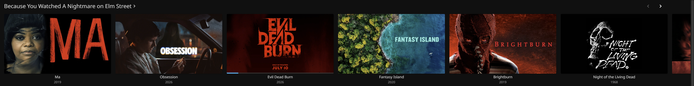

# Because You Watched

**Real "Because You Watched" rows for Jellyfin.** One row per movie you recently watched, named after that movie, filled with titles from your own library that actually match it. Ranked, not shuffled. No API keys, no external services, no setup beyond installing it.



## Why this exists

Jellyfin's built-in "Because you watched" suggestion is broken: it returns the same near-alphabetical slice of your library no matter what you watched ([jellyfin/jellyfin#16088](https://github.com/jellyfin/jellyfin/issues/16088)). Watch a slasher, get recommended a rom-com that starts with "A".

Third-party recommendation rows have the same disease from a different cause: on Jellyfin 10.11, combining genre/tag filters with other query flags silently disables the filtering, so "similar" rows fill up with random popular titles ([home-sections#243](https://github.com/IAmParadox27/jellyfin-plugin-home-sections/issues/243)).

This plugin ships its own scoring engine instead of trusting any of that.

## What you get

- **A row per recent watch.** Watched *A Nightmare on Elm Street* and *The Matrix* last week? Your home screen gets a "Because You Watched A Nightmare on Elm Street" row and a "Because You Watched The Matrix" row, each built for that specific movie.
- **Rows follow your history.** As you watch new things, the rows replace themselves automatically. No manual curation.
- **Already-watched titles are hidden** so the rows always point you at something new to you.
- **Ranked best-first.** The strongest matches lead the row.
- **Thin results are backfilled** with well-rated same-genre picks, so you never see a one-movie row.
- **100% local.** Everything is computed on your server from your own library metadata.

## How it picks movies

The engine scores every movie in your library against the seed movie using four signals:

1. **Tags (weighted heaviest).** Tags are the subcategories that make recommendations feel human: *slasher*, *hood*, *heist*, *neo-noir*, *satire*. Matches are weighted by rarity, so sharing *slasher* with the seed counts far more than sharing something generic. A built-in filter drops meaningless mood tags (*playful*, *tense*, *gritty*...) that otherwise create absurd matches.
2. **Genres.** Counted, but deliberately demoted. "Both are dramas" is weak evidence; "both are prison dramas" is strong, and tags carry that.
3. **Shared directors and writers.** Same director is the single strongest similarity signal there is, and it catches connections metadata tags miss (it is what puts *The Animatrix* and *V for Vendetta* next to *The Matrix*).
4. **Era.** Movies from the same period as the seed get a boost, so a 1988 horror seed leans 80s before it leans 2020s.

On top of the scoring there is a **tone gate**: a candidate that shares zero genres with the seed is ineligible no matter how many tags it shares. That is what stops a goofy comedy from recommending a somber drama just because both are "about the movie business."

## Requirements

- Jellyfin **10.11** or later. That is the only requirement for standalone mode.
- For the home screen rows: IAmParadox27's Home Screen Sections stack (free, install steps below).

## Install

### 1. Install the plugin

1. In Jellyfin: **Dashboard → Plugins → Repositories → +**, and add:

   ```
   https://raw.githubusercontent.com/cquest101/jellyfin-plugin-because-you-watched/main/manifest.json
   ```

2. **Catalog → Because You Watched → Install**.
3. Restart Jellyfin.

At this point standalone mode already works: a per-user **Because You Watched** playlist is built and refreshed every 12 hours. To build it immediately: **Dashboard → Scheduled Tasks → "Because You Watched: rebuild playlists" → Run**.

### 2. Get the home screen rows (recommended)

The per-movie rows render through the Home Screen Sections plugin.

1. **Dashboard → Plugins → Repositories → +**, add:

   ```
   https://www.iamparadox.dev/jellyfin/plugins/manifest.json
   ```

2. From the catalog install **File Transformation**, **Plugin Pages**, and **Home Screen Sections**.
3. Restart Jellyfin.
4. Open the user menu (top right avatar) → **Modular Home** → enable it.
5. The **Because You Watched** rows register themselves automatically and appear on the home screen. Give it a minute after restart, then hard-refresh your browser.

You can also grab the zip from [Releases](../../releases) and drop it into your Jellyfin `plugins` folder manually.

## Configuration

**Dashboard → Plugins → Because You Watched:**

| Setting | Default | What it does |
|---|---|---|
| Recent watches | 3 | How many recent movies get their own row. |
| Items per row | 16 | Maximum recommendations per row. |
| Hide watched | on | Keep already-watched titles out of the rows. |
| Backfill floor | 5 | Minimum row size before same-genre backfill kicks in. |
| Primary user | blank | Whose watch history drives the rows. Blank = the user with the most recent movie play. |
| Ignored tags | blank | Extra tags (comma-separated) to exclude from scoring, on top of the built-in mood-tag filter. |
| Standalone playlist | on | Also maintain the per-user playlist so the plugin works without Home Screen Sections. |

### Multi-user servers

The home rows are shared sections: they're named from one account's watch history (the **Primary user**). On a household server, set **Primary user** explicitly so one person's recent watches don't title the rows for everyone, and so the driving account doesn't silently switch whenever someone else finishes a movie. Watched-filtering inside each row is always per the viewing user. The standalone playlist is fully per-user either way.

## Tips for good results

The engine is only as good as your metadata. If a row looks off:

- **Refresh metadata** on your movie library (Dashboard → Libraries → ⋮ → Refresh metadata). Tags are the heaviest signal, and providers like TMDb supply them; a library with rich tags gets dramatically better rows.
- A movie appearing where it shouldn't usually means it shares a misleading tag with the seed. Find the tag on both movies and add it to **Ignored tags**.

## Troubleshooting

| Symptom | Fix |
|---|---|
| Rows don't appear after install | Confirm all three Home Screen Sections plugins show **Active** under Dashboard → Plugins, Modular Home is enabled for your user, and restart Jellyfin once more. |
| Home screen looks unchanged | Browser cache. Hard-refresh (Ctrl+Shift+R), or DevTools → Network → Disable cache → refresh. |
| Rows lag behind what I just watched | Rows re-register every 15 minutes. Finish a movie, give it a few minutes. |
| Playlist exists but no rows | You're in standalone mode; install the Home Screen Sections stack (step 2 above). |

## How it works (for developers)

- `Startup/HomeSectionsRegistrar.cs` is a hosted service that discovers Home Screen Sections at runtime via reflection (no compile-time dependency) and registers one section per recent watch, re-checking every 15 minutes.
- `BecauseYouWatchedResults.cs` serves each row's items when the home screen requests them.
- `RecommendationEngine.cs` is the scoring engine described above. All filtering and ranking happens in code against a single broad library query, deliberately avoiding the 10.11 `InternalItemsQuery` genre/tag filter behavior that breaks other plugins.
- `Startup/RebuildPlaylistsTask.cs` is the standalone-mode scheduled task.

Build:

```
dotnet build Jellyfin.Plugin.BecauseYouWatched/Jellyfin.Plugin.BecauseYouWatched.csproj -c Release
```

CI builds every push; a `v*` tag packages the zip, creates a GitHub release, and updates `manifest.json` automatically.

## Credits

- [IAmParadox27](https://github.com/IAmParadox27) for the Home Screen Sections stack the rows render through.

## License

MIT. See [LICENSE](LICENSE).
